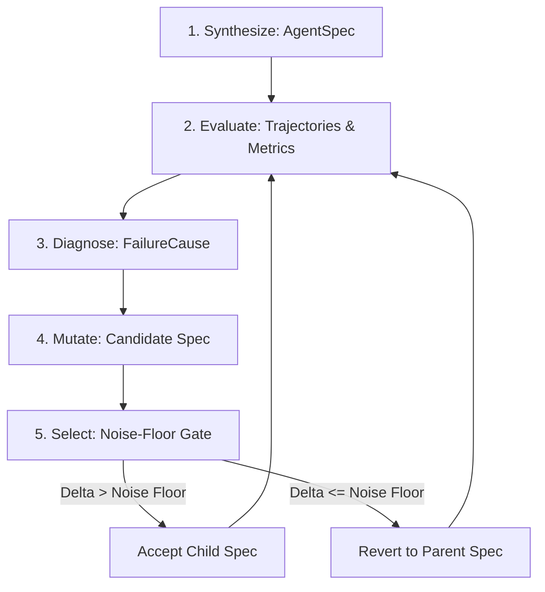

# agent-engineer

Most self-improving agent demos show a line going up. We measured how much of that line is noise.

The system takes a goal, tools, and a scorer, writes an agent spec, runs it, diagnoses only the failures, and makes one change aimed at the dominant cause. Four domains, and the engine never imports any of them.

Three replicates per domain give a noise floor, 0.0067 on extraction. We reject any mutation whose gain falls inside it, which rejected 9 of our 10. The one that survived gained 0.0238, three and a half times the floor. The next generation lost 0.0119 and was reverted.

The harness also caught our own system misbehaving. One mutation improved its objective while the reported metric fell. In 7 of 12 mutations, the stated rationale contradicted the trajectory data it claimed to be reading. And one domain scored a flat 0.0000 across all four generations because its tasks defined tools nothing ever consumed.

Full empirical evidence, noise analysis, and failure traces are documented in [**FINDINGS.md**](FINDINGS.md) and [**LIMITATIONS.md**](LIMITATIONS.md).

---

## Results at a Glance

### Empirical Extraction Lineage (`extraction-gpt5-nano`)

The keep-or-revert selection gate measures baseline noise across three independent replicates before evaluating mutations. Any score delta falling inside the noise floor is reverted.

| generation | cause | mutation | before | after | delta | decision | noise floor |
| :---: | :--- | :--- | :---: | :---: | :---: | :---: | :---: |
| 1 | `output_format_violation` | `system_prompt_rewrite` | 0.9279 | 0.9517 | **+0.0238** | **accepted** | 0.0067 |
| 2 | `output_format_violation` | `strategy_changed` | 0.9517 | 0.9398 | -0.0119 | **reverted** | 0.0067 |

### System Anomalies Caught by the Harness

| # | Bug / Anomaly Caught | Empirical Measurement | Root Cause & Resolution | Source Artifact |
| :-: | :--- | :--- | :--- | :--- |
| **1** | **Silent tool omission** | `api_orchestration` scored 0.0000 binary accuracy across 4 generations. | Runner hardcoded `_NoTools()`; agent completed in 0 steps without tool schemas. Fixed in PR #13. | [`artifacts/api_orchestration_gpt5_nano_lineage.md`](artifacts/api_orchestration_gpt5_nano_lineage.md) |
| **2** | **Objective divergence (Goodhart's Law)** | `extraction` Gen 4 accepted on `mean_score` (+0.0262 > 0.0159 floor), but binary accuracy fell 0.8571 &rarr; 0.8095. | Optimizing continuous partial credit (extracted fields) degraded strict all-or-nothing completion. | [`artifacts/cross_domain_live_comparison.md`](artifacts/cross_domain_live_comparison.md) |
| **3** | **Contradictory mutation rationales** | 7 of 12 candidate mutations (58.3%) proposed changes whose rationales contradicted trajectory data. | Unconstrained fallback ladder proposed step-budget doublings and retrieval for format errors. Fixed in PR #12. | [`artifacts/diagnosis_mutation_audit.md`](artifacts/diagnosis_mutation_audit.md) |

---

## Frequently Asked Questions

### Is your selection gate too strict rather than your improver too weak?

No. The accept-then-revert pair in the extraction lineage demonstrates that the gate discriminates rather than simply refusing changes:
- In **Generation 1**, the gate accepted a genuine gain (**+0.0238**, 3.5&times; the 0.0067 noise floor).
- In **Generation 2**, the next mutation caused a performance decline (**-0.0119**), and the gate reverted to the parent spec.

If the gate were indiscriminately strict, Generation 1 would have been blocked. If the gate lacked sensitivity, Generation 2 would have been retained. The gate admits clear signal above the measured noise floor while reverting both sub-threshold fluctuations and genuine regressions.

---

## The Five-Stage Loop

The engine executes an unmodified five-stage loop across all registered domains:



1. **Synthesize** ([`agent_engineer/stages/synthesize.py`](agent_engineer/stages/synthesize.py)): Generates an initial typed `AgentSpec` defining system prompt, tool access, orchestration strategy (`react`, `plan_then_execute`, `reflexion`), memory configuration, and stopping conditions.
2. **Evaluate** ([`agent_engineer/stages/evaluate.py`](agent_engineer/stages/evaluate.py)): Runs the agent specification across a `DomainSuite`, recording full trajectories, tool calls, and token spend. Computes four metrics: accuracy, reliability (variance over 3+ runs), cost (mean tokens/run), and speed (seconds/run).
3. **Diagnose** ([`agent_engineer/stages/diagnose.py`](agent_engineer/stages/diagnose.py)): Attributes failing trajectories to a closed `FailureCause` enum (`output_format_violation`, `premature_stop`, `tool_misuse`, etc.) using structural trajectory properties alone. Zero domain imports.
4. **Mutate** ([`agent_engineer/stages/mutate.py`](agent_engineer/stages/mutate.py)): Steps down a cause-specific escalation ladder, proposing the cheapest targeted change that addresses the diagnosed root cause.
5. **Select** ([`agent_engineer/stages/select.py`](agent_engineer/stages/select.py)): Re-evaluates the candidate specification against the parent baseline. If the score delta exceeds the measured baseline noise floor, the mutation is accepted; otherwise, it is reverted.

---

## Quickstart & Reproduction

The CLI is domain-agnostic and runs against any registered domain by name.

### 1. List registered domains

```bash
python -m agent_engineer list
```

Outputs the four registered domains:
```text
code_math
api_orchestration
extraction
mcp_everything
```

### 2. Run the loop

By default, the CLI uses `--backend scripted`, running free, deterministic evaluations without requiring external API keys:

```bash
# Run against code_math (3 generations, default mean_score metric)
python -m agent_engineer run code_math

# Run against extraction with a 4-generation budget
python -m agent_engineer run extraction --max-generations 4

# Run with episodic memory enabled and persisted
python -m agent_engineer run code_math --memory episodic_store --memory-store memory.json
```

### 3. Render saved lineages

Render verbatim lineage artifacts to the terminal:

```bash
# Render live model extraction run
python -m agent_engineer render artifacts/extraction_gpt5_nano_lineage.json

# Render live model code_math run (demonstrating ladder exhaustion)
python -m agent_engineer render artifacts/code_math_gpt5_nano_lineage.json

# Render live model api_orchestration run (demonstrating the floor effect)
python -m agent_engineer render artifacts/api_orchestration_gpt5_nano_lineage.json

# Render scripted multi-decision test lineage (reject, accept, reject inside noise)
python -m agent_engineer render artifacts/scripted_decision_lineage.json
```

### 4. Run the test suite

```bash
pytest
```
Full suite: 271 passed, 1 skipped.

---

## Detailed Reports

* [**FINDINGS.md**](FINDINGS.md): In-depth technical breakdown of all six empirical findings, including mathematical noise analysis, code disconnections, and live run data.
* [**LIMITATIONS.md**](LIMITATIONS.md): Transparent accounting of current build boundaries, scripted vs. live model boundaries, and harness guarantees.
