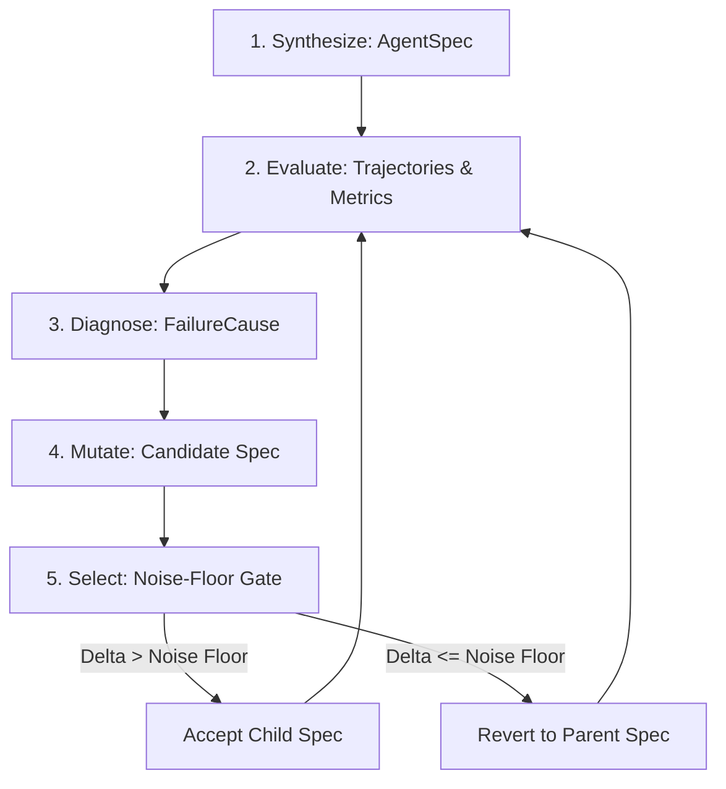

# agent-engineer

An automated agent-engineering loop that iteratively optimizes an `AgentSpec` across domain benchmarks. It synthesizes an initial agent specification, evaluates it against a domain task suite, diagnoses failures from trajectory structure alone, proposes targeted mutations along cause-honest escalation ladders, and accepts or reverts candidate mutations against an empirical noise floor.

This repository is a hackathon submission evaluating four core questions:
1. **How does the agent get better over time?** By proposing targeted mutations to prompts, strategies, memory, and budgets, keeping only those that measurably clear run-to-run sampling variance.
2. **Can you show memory growing?** Through an `EpisodicMemoryStore` accumulating typed reflections (0 &rarr; 29 entries) with top-$k$ retrieval.
3. **Can it learn contextual logic from tools?** By diagnosing execution failures from structural trajectory signals (tool errors, missing parameters, premature termination) and attempting targeted interventions.
4. **Is it cost-effective?** By strictly pairing all accuracy numbers with token consumption and enforcing budget caps.

> [!IMPORTANT]
> **What this project found**: The agent largely did **not** improve across live model runs (0/4 accepted on `code_math`, 0/4 accepted on `api_orchestration`, 1/4 accepted on `extraction` where partial credit rose while binary accuracy fell). The genuine strength of the system is what it **measured, caught, and prevented**: it rejected regressions, prevented false wins via empirical noise floors, exposed a silent benchmark bug through token cost accounting, and discovered and fixed a broken diagnosis-to-mutation link.

Full details are documented in [**FINDINGS.md**](FINDINGS.md) and [**LIMITATIONS.md**](LIMITATIONS.md).

---

## The Five-Stage Loop

The engine executes an unmodified five-stage loop across all registered domains:



1. **Synthesize** ([`agent_engineer/stages/synthesize.py`](agent_engineer/stages/synthesize.py)): Generates an initial typed `AgentSpec` defining system prompt, tool access, orchestration strategy (`react`, `plan_then_execute`, `reflexion`), memory configuration, and stopping conditions.
2. **Evaluate** ([`agent_engineer/stages/evaluate.py`](agent_engineer/stages/evaluate.py)): Runs the agent specification across a `DomainSuite`, recording full trajectories, tool calls, and token spend. Computes four metrics: accuracy, reliability (variance over 3+ runs), cost (mean tokens/run), and speed (seconds/run).
3. **Diagnose** ([`agent_engineer/stages/diagnose.py`](agent_engineer/stages/diagnose.py)): Attributes failing trajectories to a closed `FailureCause` enum (`output_format_violation`, `premature_stop`, `tool_misuse`, etc.) using structural trajectory properties alone. Zero domain imports.
4. **Mutate** ([`agent_engineer/stages/mutate.py`](agent_engineer/stages/mutate.py)): Steps down a cause-specific escalation ladder, proposing the cheapest targeted change that addresses the diagnosed root cause.
5. **Select** ([`agent_engineer/stages/select.py`](agent_engineer/stages/select.py)): Re-evaluates the candidate specification against the parent baseline. If the score delta exceeds the measured baseline noise floor, the mutation is accepted; otherwise, it is reverted.

---

## Quickstart & Reproduction

The CLI is domain-agnostic and runs against any registered domain by name.

### 1. List registered domains

```bash
python -m agent_engineer list
```

Outputs the four registered domains:
```text
code_math
api_orchestration
extraction
mcp_everything
```

### 2. Run the loop

By default, the CLI uses `--backend scripted`, running free, deterministic evaluations without requiring external API keys:

```bash
# Run against code_math (3 generations, default mean_score metric)
python -m agent_engineer run code_math

# Run against extraction with a 4-generation budget
python -m agent_engineer run extraction --max-generations 4

# Run with episodic memory enabled and persisted
python -m agent_engineer run code_math --memory episodic_store --memory-store memory.json
```

### 3. Render saved lineages

Render verbatim lineage artifacts to the terminal:

```bash
# Render live model extraction run (demonstrating Goodhart's law)
python -m agent_engineer render artifacts/extraction_gpt5_nano_lineage.json

# Render live model code_math run (demonstrating ladder exhaustion)
python -m agent_engineer render artifacts/code_math_gpt5_nano_lineage.json

# Render live model api_orchestration run (demonstrating the floor effect)
python -m agent_engineer render artifacts/api_orchestration_gpt5_nano_lineage.json

# Render scripted multi-decision test lineage (reject, accept, reject inside noise)
python -m agent_engineer render artifacts/scripted_decision_lineage.json
```

### 4. Run the test suite

```bash
pytest
```
Full suite: 271 passed, 1 skipped.

---

## Headline Findings Summary

| # | Headline Finding | Empirical Measurement / Evidence | Mechanism / Root Cause | Source Artifact |
| :-: | :--- | :--- | :--- | :--- |
| **1** | **Domain-Agnostic Diagnosis, Shown Live** | Diagnosed `output_format_violation` for extraction (14 tasks), and `premature_stop` for code_math (16 tasks) and api_orchestration (12 tasks). | Purely structural rules (`_rule_partial_credit`, `_rule_stopped_early`) over trajectory objects; no domain imports. | [`artifacts/cross_domain_live_comparison.md`](artifacts/cross_domain_live_comparison.md) |
| **2** | **Silent Harness Bug Exposed by Token Cost** | `api_orchestration` scored 0.0000 binary accuracy. Token cost was **234.7 tok/run** (lowest of three domains, vs 352.8 and 613.0 for single-shot). | Tasks specified `call_tool` and `tool_schemas` in metadata, but the runner hardcoded `_NoTools()` and the backend discarded tools. Exactly 96 calls across 12 tasks (8.000 calls/task, 0 tool steps). Fixed in PR #13. | [`artifacts/api_orchestration_gpt5_nano_lineage.md`](artifacts/api_orchestration_gpt5_nano_lineage.md), PR #13 |
| **3** | **Goodhart's Law Caught in Our Own System** | Extraction Gen 4 was accepted on `mean_score` (+0.0262 delta > 0.0159 noise floor), but binary `accuracy` fell 0.8571 &rarr; 0.8095 (-0.0476 drop). | The accuracy drop (-0.0476) sat inside accuracy's noise floor (0.0583). Optimizing partial credit cannibalized binary completion. Both floors measured. | [`artifacts/extraction_gpt5_nano_lineage.md`](artifacts/extraction_gpt5_nano_lineage.md) |
| **4** | **Broken Diagnosis-to-Mutation Link Caught & Fixed** | Mutation proposals previously asserted causes different from the diagnosed failure (e.g. step budget increases for format violations). | Generic fallback ladder was proposing irrelevant moves. Fixed in `b6e8444`: strictly cause-honest ladders and deduplication over `(kind, target_path, after)`. | Commit [`b6e8444`](https://github.com/RedtRocks/aohack/commit/b6e844480b3a71f580fdee4d603f50f569d6dc75) |
| **5** | **Honest Negative on Memory, with Mechanism** | Episodic memory grew 0 &rarr; 29 entries on `code_math`, adding **+29.6 tok/task** (+70.6%) prompt overhead without saving tool calls. | Single-turn tasks have zero execution steps to prune. Memory is a pure token tax unless it eliminates multi-hop tool exploration. | [`artifacts/episodic_memory_growth_demo.md`](artifacts/episodic_memory_growth_demo.md) |
| **6** | **Measurement Discipline Throughout** | Zero LLM judges across all four domains. Accuracy denominator includes refusals; empty denominators are undefined, never zero. | Deterministic evaluators (code execution, JSON diffing, simulated API state verification). Noise floors measured before mutating. Accuracy always paired with cost. | [`LIMITATIONS.md`](LIMITATIONS.md), [`agent_engineer/evaluation/`](agent_engineer/evaluation/) |

---

## Detailed Reports

* [**FINDINGS.md**](FINDINGS.md): In-depth technical breakdown of all six findings, including mathematical noise analysis, code disconnections, and live run data.
* [**LIMITATIONS.md**](LIMITATIONS.md): Transparent accounting of current build boundaries, scripted vs. live model boundaries, and harness guarantees.
